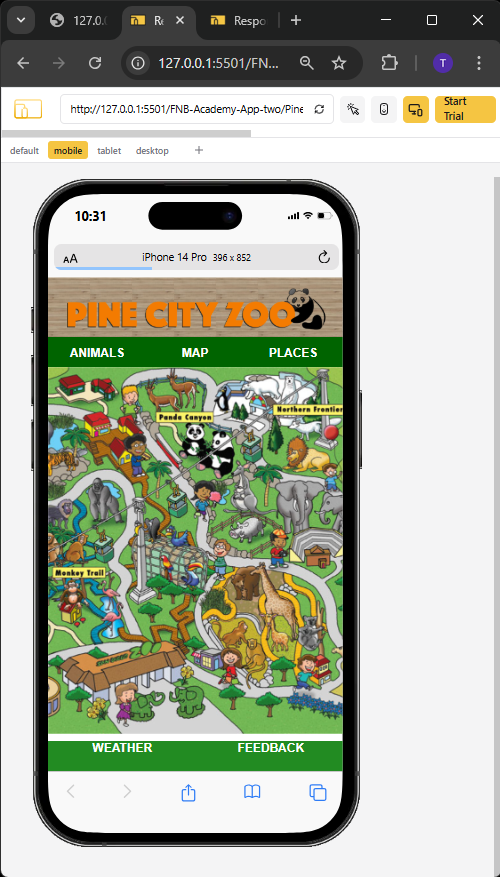
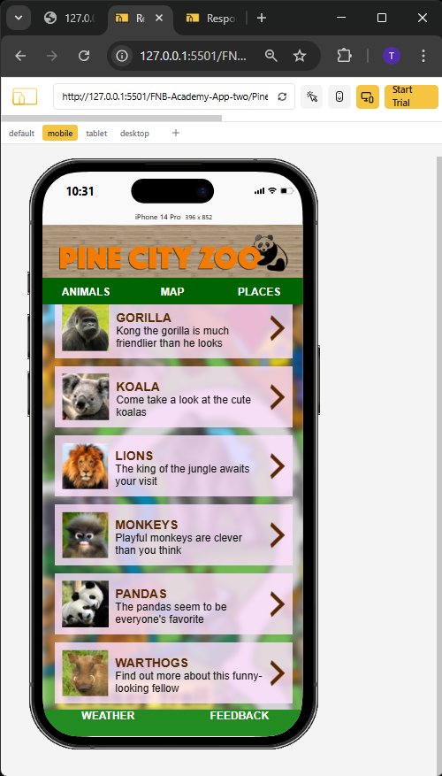
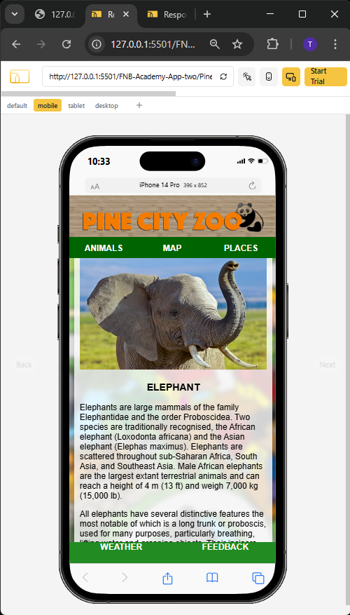
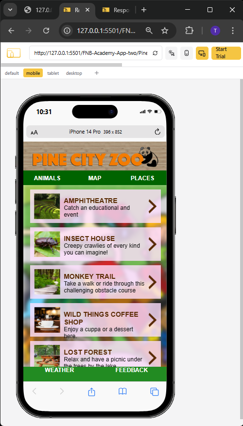
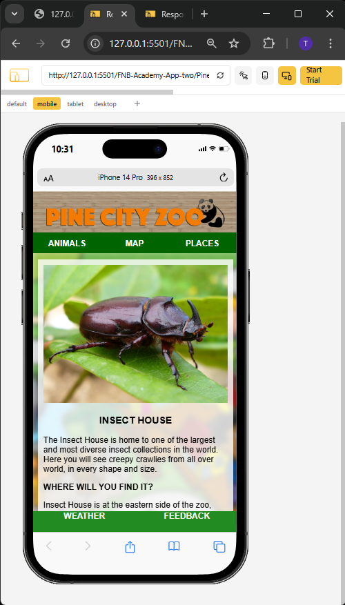
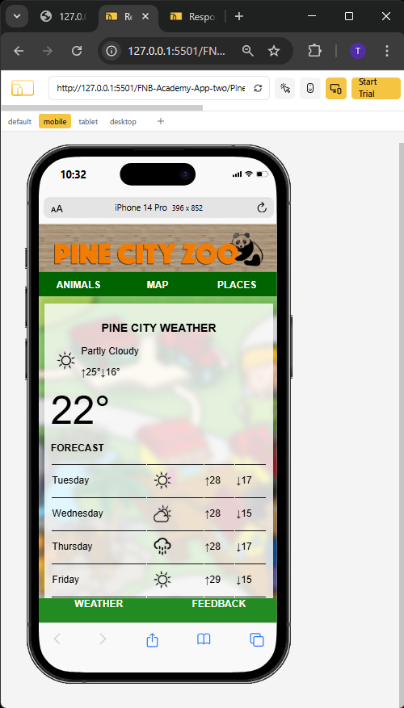

# 🦁 Zoo Map Web Page

This project is a simple and visually structured HTML web page designed to display a zoo map along with navigation to related sections like animals, places, weather, and feedback. It's part of a beginner-friendly front-end project using only **HTML** and **CSS**.

## 📁 Project Structure
project-folder/
│
├── index.html
├── style.css
└── images/
├── logo.png
└── map.png

## 🌐 Features

- Responsive zoo map image
- Header with zoo logo
- Top and bottom navigation bars
- Links to:
  - Animals page
  - Map (current)
  - Places page
  - Weather
  - Feedback

## 🛠️ Technologies Used

- HTML5
- CSS3

## 📸 Preview

## 👨‍💻 Author

**Tshepang Oliver**  
FNB App Academy 2025  
[GitHub Profile](https://github.com/T5H3P4N9)
[LinkedIn Profile](https://www.linkedin.com/in/tshepang-oliver-3a5540205/)

